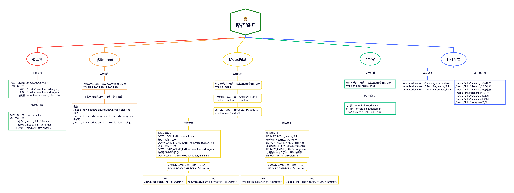
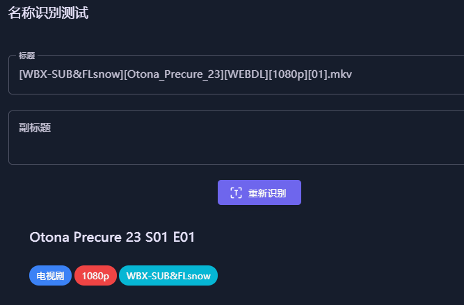
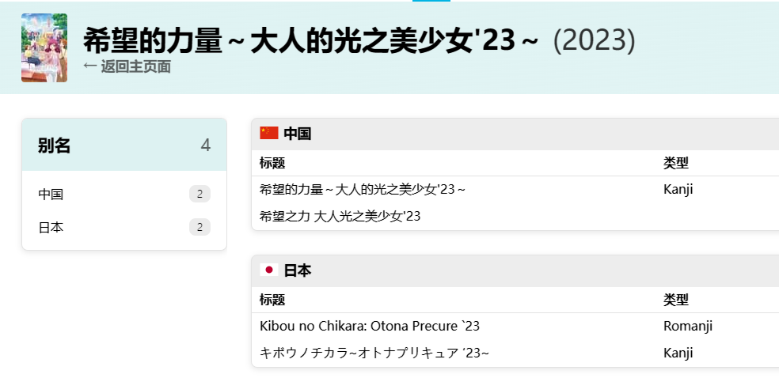
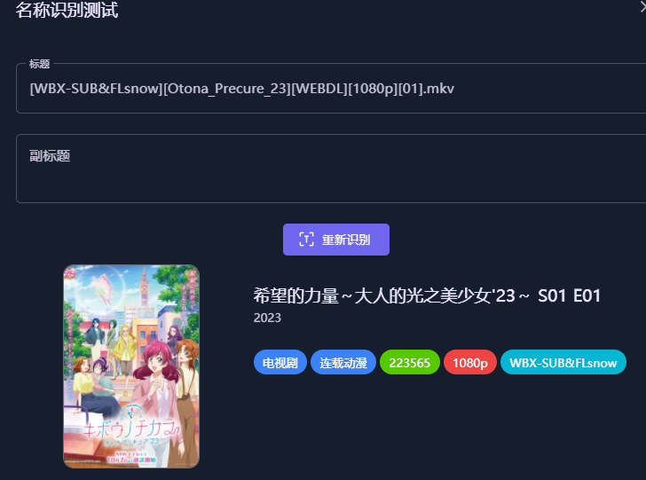
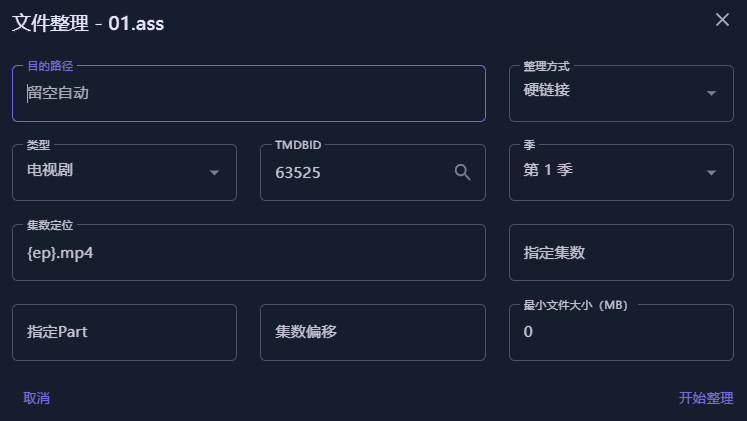

 - [一些说明](#一些说明)
 - [站点问题](#站点问题)
   - [为什么我的站点添加不了？](#为什么我的站点添加不了)
   - [日志提示站点认证失败 / 软件界面没有站点管理](#日志提示站点认证失败--软件界面没有站点管理)
   - [为什么我的站点添加了搜索不到内容？](#为什么我的站点添加了搜索不到内容)
   - [为什么CookieCloud一直同步失败？](#为什么cookiecloud一直同步失败)
 - [转移问题](#转移问题)
   - [转移媒体文件时提示“-1”错误](#转移媒体文件时提示-1错误)
 - [刮削问题](#刮削问题)
   - [刮削完成后演员不显示头像/英文名字](#刮削完成后演员不显示头像英文名字)
   - [刮削很慢或者是刮削不出图片](#刮削很慢或者是刮削不出图片)
   - [资源不识别导致无法刮削](#资源不识别导致无法刮削)
   - [文件名为"01.mp4"如何进行转移？](#文件名为01mp4如何进行转移)
 - [订阅问题](#订阅问题)
   - [日志里一直在搜索匹配没有订阅的电影/电视剧](#日志里一直在搜索匹配没有订阅的电影电视剧)
   - [日志提示添加任务失败](#日志提示添加任务失败)
 - [功能补充](#功能补充)
   - [自定义制作组/字幕组](#自定义制作组字幕组)
   - [自定义占位符](#自定义占位符)
   - [自定义重命名](#自定义重命名)
 - [微信通知问题](#微信通知问题)
   - [如何配置企业微信通知](#如何配置企业微信通知)
   - [如何建立企业微信的代理服务器？](#建立企业微信的代理服务器)
   - [配置企业微信时提示“回调失败”](#配置企业微信时提示回调失败)
   - [企业微信部署后不显示菜单](#企业微信部署后不显示菜单)
 - [其他问题](#其他问题)
   - [日志的时间显示不对 / 任务的执行时间不对](#日志的时间显示不对--任务的执行时间不对)
   - [插件界面显示404](#插件界面显示404)
   - [MoviePilot可以配置多个下载器吗？](#moviepilot可以配置多个下载器吗)
   - [ocr部署后无故自动重启无法使用](#ocr部署后无故自动重启无法使用)
   - [IOS快捷指令快速跳转MoviePilot搜索](#ios快捷指令快速跳转moviepilot搜索)


# **一些说明**
 - 本仓库仅作为对[Moviepilot](https://github.com/jxxghp/MoviePilot/blob/main/README.md)的一些使用上的内容补充，发现问题时，请先仔细阅读原项目的[Readme](https://github.com/jxxghp/MoviePilot/blob/main/README.md)
  
 - [Moviepilot](https://github.com/jxxghp/MoviePilot/blob/main/README.md)的`docker&docker-compose`配置模板及`Ocr服务`的搭建教程[DDS-Derek/MoviePilot](https://github.com/DDS-Derek/MoviePilot/tree/docs)

 - 由于[Moviepilot](https://github.com/jxxghp/MoviePilot/blob/main/README.md)是在[Nastool](https://github.com/NAStool/nas-tools)的基础上开发的，因此很多教程也是共通的，例如`微信、tg、部分插件`的配置教程就可以参考[Nastool](https://github.com/NAStool/nas-tools)的相关教程。

 - 除此之外部分内容也可以参考[nas-tools-wiki](https://github.com/NAStool/nas-tools-wiki)的说明进行配置。

 - 提问题前一定记着先去看看日志，一般日志会写出问题所在，在提问时记得附上日志截图

 - 待补充
    
<br>

---

# **站点问题**

- ### 为什么我的站点添加不了？
  MoviePilot使用的是`域名白名单`机制，如果添加不了可以去`站点公告`或者论坛查看站点的其他可用域名，并尝试添加。

例如问的最多的馒头，可以尝试将域名的`.cc`更改为`.io`进行添加

<br>

- ### 日志提示站点认证失败 / 软件界面没有站点管理

1.查看[环境变量](https://github.com/jxxghp/MoviePilot/blob/main/README.md#2-用户认证)是否配置好,例如`iyuu`需要同时配置`AUTH_SITE` 、`IYUU_SIGN`两个变量

2.检查站点连接性，一般可能是代理的配置问题，可以尝试调整代理软件的规则。

<br>

- ### 为什么我的站点添加了搜索不到内容？
  可通过**查看日志**按以下顺序排查
  1. `站点`或`tmdb`是否能正常连接上
  2. 检查是否返回了搜索结果
  3. 搜索结果是否被`搜索优先级`过滤
  4. 有时种子名与tmdb进行匹配时，由于命名问题可能会同时存在多个同名影视，导致匹配到其他影视剧，也会造成搜索失败，此时建议直接去站点或是使用ptpp进行检索下载。
  5. 站点的种子命名与tmdb对应不上时，MoviePilot会将中搜索结果这部分内容丢弃。出现这种情况的话可以先去站点手动检索，并添加一个自定义识别词，将站点的命名替换为tmdb的命名，再尝试搜索&订阅。

<br>

- ### 为什么CookieCloud一直同步失败？
  1. 如果使用的是公共的CookieCloud服务端，需要检查一下容器内部是否能够连接上服务端。
   
  2. 如果是本地自建的CookieCloud，浏览器可以正常连接而MoviePilot无法连接，一般可能是因为代理将本地地址也一并代理了。可以将代理配置为规则代理，并将本地地址设定为直连，也可以在环境变量中添加`no_proxy=localhost,127.0.0.0/8,10.0.0.0/8,172.16.0.0/12,192.168.0.0/16`，再进行尝试。

---

# **转移问题**

- ### 转移媒体文件时提示“-1”错误
一般出现这种提示是出现了跨盘的问题，在建立docker容器时，路径的映射容易出现以下情况
```yaml
        volumes:
            - '/volume1/video/media:/media'
            - '/volume1/video/link:/link'
```
此时在容器内部，视频文件和硬链接目录为无隶属关系的两个文件夹，此时使用硬链接时便会报错。正确的路径映射应为下面这种
```yaml
        volumes:
            - '/volume1/video:/volume1/video'
        #此时环境变量中的路径设置
        environment:
            # 下载保存目录
            - 'DOWNLOAD_PATH=/volume1/video/download'
            - 'DOWNLOAD_MOVIE_PATH=/volume1/video/download/movies'
            - 'DOWNLOAD_TV_PATH=/volume1/video/download/tv'
            - 'DOWNLOAD_ANIME_PATH=/volume1/video/download/anime'
            # 媒体库目录
            - 'LIBRARY_PATH=/volume1/video/link'
            - 'LIBRARY_MOVIE_NAME=movies'
            - 'LIBRARY_TV_NAME=tv'
            - 'LIBRARY_ANIME_NAME=anime'

```
保持目录与宿主机一致，此时在配置文件中可以在后续维护中减少出问题的概率。关于其他容器关于路径的配置问题可以参见下面这张图
 <div align=center>  </div>

<br>

**补充①**:有些文件系统无法使用符号链接，此时硬链接与软链接均会报错，例如:`exFAT`,`FAT32`

除此之外，在`NTFS`文件系统上也可能会出现无法创建链接的问题。

**补充②**:使用网盘挂载时，请选择`rclone`或`软链接`的方式进行整理。

---

# **刮削问题**

- ### 刮削完成后演员不显示头像/英文名字

1.使用`演职人员刮削`插件,填写`扫描周期`后即可。

2.使用[MediaServerTools](https://github.com/sleikang/MediaServerTools)来刷新emby的元数据，config文件可在[这里](https://github.com/sleikang/MediaServerTools/blob/main/config/config.yaml)下载。

```yaml
version: '3.3'
services:
    MediaServerTools:
        container_name: MediaServerTools
        volumes:
            - './config:/config'
        environment:
            - TZ=Asia/Shanghai
            - PUID=1000
            - PGID=1000
            - UMASK=022
            - MediaServerTools_AUTO_UPDATE=true # 自动更新
            - MediaServerTools_CN_UPDATE=true # 使用国内源更新
        network_mode: host
        logging:
          driver: json-file
          options:
            max-size: 5m
        image: 'ddsderek/mediaservertools:latest'

```

<br>

- ### 刮削很慢或者是刮削不出图片

1.检查日志

2.检查Tmdb、FanArt等网站的的连接性，推荐将这些站点手动添加到代理的规则列表或配置文件中。以下以clash为例：
```yaml
  - DOMAIN-SUFFIX,fanart.tv,🚀 节点选择 #🚀 节点选择更改为clash文件中的代理服务器组的名称即可
  - DOMAIN-KEYWORD,tmdb,🚀 节点选择
  - DOMAIN-KEYWORD,themoviedb,🚀 节点选择  
```

<br>

- ### 资源不识别导致无法刮削

1.检查日志，查看是否能正常连接tmdb

2.资源名称命名与tmdb不同导致无法识别，下面是一个例子

 <div align=center>  </div>

 通过检查tmdb的剧集的别名可以看到，该剧集目前是没有`Otona_Precure_23`的译名的，因此也会导致MoviePilot无法识别
 
 <div align=center>  </div>

解决方法也很简单，在`设定-词表-自定义识别词`中填写

> **Otona_Precure_23 => Kibou no Chikara: Otona Precure `23**
> 
> 推荐优先将替换为**英文译名或原名**，中文译名有时候会歧义导致被经常修改

之后就可以正常识别了，有时候改完以后还无法识别，可以先**清除缓存**后再进行尝试。

 <div align=center>  </div>


<br>

- ### 文件名为"01.mp4"如何进行转移？
该文件命名MoviePilot无法识别，需要进行手动转移，转移的配置如下。
 <div align=center>  </div>

<br>

---

# **订阅问题**

- ### 日志里一直在搜索匹配没有订阅的电影/电视剧

MoviePilot会定期使用站点的rss来匹配是否有订阅内容，此时会在日志中产生这些记录，对实际使用没有影响。

<br>

- ### 日志提示添加任务失败

1.检查下载器的配置信息，MoviePilot是否能正常连接下载器

2.检查下载器日志，是否因为多次密码错误而将MoviePilot的ip地址拉入黑名单

3.检查下载器内是否已经有相同的下载任务


<br>


- ### spider / rss订阅模式的区别

**spider模式**:添加订阅时，向所有订阅站点请求一次搜索，并对搜索结果进行匹配，对媒体库中不存在的剧集进行下载操作。之后每隔一段时间重复上述操作。

**rss模式**:首次添加订阅时，会进行与spider模式相同的操作，但之后更新内容的方式变为使用站点的RSS来获取新剧集的信息，因此使用该模式时需要配置好站点的RSS链接的内容，例如只勾选电视剧/动画，或者只指定需要订阅的官组，这样可以使RSS的内容更加干净，减少无关内容造成的订阅错误。

---

# **功能补充**

- ### 自定义制作组/字幕组

> 补充制作组/字幕组的识别规则，填写位置为`设置-词表-自定义制作组/字幕组`
>

`(?<=264\-)\w+(?=\.mkv);(?<=265\-)\w+(?=\.mkv)`

`(?<=264\-)\w+(?=\.mp4);(?<=265\-)\w+(?=\.mp4)`

`ADWeb`

- ### 自定义占位符

> 补充制作组/字幕组的识别规则，填写位置为`设置-词表-自定义占位符`
>

`(?<=1080p\.).*(?=\.WEB-DL);(?<=2160p\.).*(?=\.WEB-DL);(?<=1080p\.).*(?=\.WEBRip);(?<=2160p\.).*(?=\.WEBRip)`

`\b(Baha|CR|B-Global|ABEMA|MyVideo|AMZN|KKTV|friDay|DSNP|LINETV|Crunchyroll|IQ|Hulu|HQ|60fps|Paramount+|LineTV|Linetv|Disney+|FriDay|HMAX|MAX|NF|IQY|IQ|TX|WeTV|YT|YK|Migu|Mgtv|Bilibili|Sohu|Xigua|iTunes)\b`


- ### 自定义重命名

**剧集：**

`{{title}} ({{year}})/Season {{season}}/{{title}} - {{season_episode}}-{{part}} - {{videoFormat}} - {{videoCodec}} - {{audioCodec}} - {{customization}} - {{releaseGroup}}{{fileExt}}`

**电影：**

`{{title}} ({{year}})/{{title}} ({{year}})-{{part}} - {{videoFormat}} - {{videoCodec}} - {{audioCodec}} - {{releaseGroup}}{{fileExt}}`

---

# **微信通知问题**

- ### 如何配置企业微信通知
  
  参见[此教程](https://pt-helper.notion.site/50a7b44e255d40109bd7ad474abfeba5)

  <br>

- ### 建立企业微信的代理服务器
  
首先需要先准备一个具有固定公网地址的服务器，例如VPS，之后在该服务器上搭建代理服务。

 > 使用[`caddy`](https://github.com/caddyserver/caddy)搭建

  1. 从 https://github.com/caddyserver/caddy/releases
下载自己对应系统的版本，例如 AMD64 下载`caddy_2.7.5_linux_amd64.tar.gz`
  1. 解压得到 `caddy` 文件 上传到`/usr/local/bin` 目录下，注意设置权限 `0755`
  2. 在任意目录新建 `Caddyfile` 文件(例如`/usr/local/caddy`) ，注意设置权限 `0755`，文
件内容如下
```yaml
:3000
reverse_proxy https://qyapi.weixin.qq.com {
header_up Host {upstream_hostport}
}
```
  1. SSH 控制台 cd 到 `Caddyfile` 文件的目录(例如`/usr/local/caddy`)
  2. 输入 caddr start 启动完成，在防火墙中放行3000端口
  3.  NasTools / MoviePilot 设置微信的代理 IP 地址为 `http://你的服务器ip/域名:3000`

<br>

 > 使用[`ddsderek/wxchat`](https://hub.docker.com/r/ddsderek/wxchat)docker镜像搭建

```yaml
version: '3.3'
services:
    wxchat:
        container_name: wxchat
        restart: always
        ports:
            - '3000:80'
        image: 'ddsderek/wxchat:latest'
```
```
docker run -d \
    --name wxchat \
    --restart=always \
    -p 3000:80 \
    ddsderek/wxchat:latest
```
搭建完成后，在防火墙中放行3000端口，并在NasTools / MoviePilot 设置微信的代理 IP 地址为 `http://你的服务器ip/域名:3000`

<br>

- ### 配置企业微信时提示“回调失败”
  
 1.填写的地址应为`http://ip:端口/api/v1/message/`。

 2.确认在手机打开流量时，直接打开`http://ip:端口`，可以直接访问MoviePilot的网页。

 3.微信不支持ipv6,因此如果域名是使用ipv6解析的时候，也会导致不通过。如果没有ipv4的公网ip，建议使用内网穿透。

 <br>

 - ### 企业微信部署后不显示菜单
MoviePilot在成功部署后通常会自动生成微信菜单，可以检查配置信息后重启容器，再进行尝试。

如果还是没有正常生成菜单，则可以手动添加菜单，具体的命令列表如下。

> /cookiecloud 同步站点
> 
> /sites 查询站点
> 
> /site_cookie 更新站点Cookie
> 
> /site_enable 启用站点
> 
> /site_disable 禁用站点
> 
> /mediaserver_sync 同步媒体服务器
> 
> /subscribes 查询订阅
> 
> /subscribe_refresh 刷新订阅
> 
> /subscribe_search 搜索订阅
> 
> /subscribe_delete 删除订阅
> 
> /subscribe_tmdb 订阅元数据更新
> 
> /downloading 正在下载
> 
> /transfer 下载文件整理
> 
> /redo 手动整理
> 
> /clear_cache 清理缓存
> 
> /restart 重启系统
> 
> /site_signin 站点签到
> 
> /site_statistic 站点数据统计

 <br>

---

# **其他问题**

- ### 日志的时间显示不对 / 任务的执行时间不对

添加**环境变量**`TZ=Asia/Shanghai`

<br>

- ### 插件界面显示404

在网页右下角有一个“+”号，点击即可添加插件

<br>


 - ### MoviePilot可以配置多个下载器吗？
  目前只支持配置**一个**`Qbittorrent`和**一个**`Transmission`

<br>

 - ### Ocr部署后无故自动重启/无法使用

Ocr与主机的CPU有关，无法使用通常是CPU不支持导致的，例如常用的J4125就无法部署。

<br>

 - ### IOS快捷指令快速跳转MoviePilot搜索

  参见此项目[Shortcuts-Moviepilot](https://github.com/honue/Shortcuts-Moviepilot)
