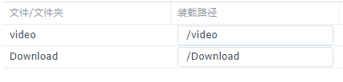
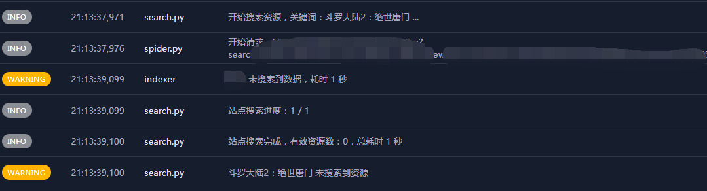
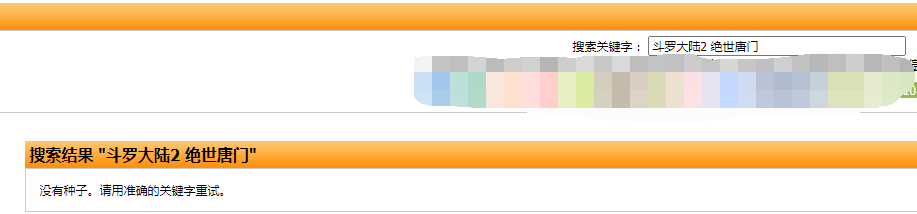
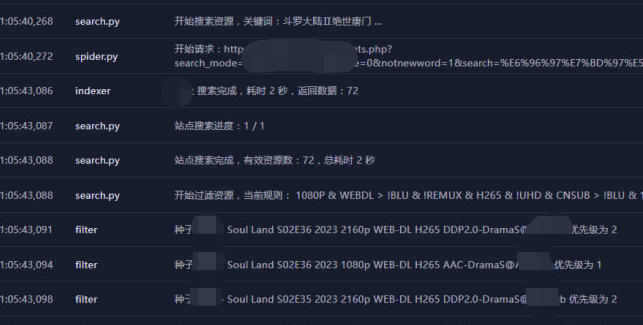
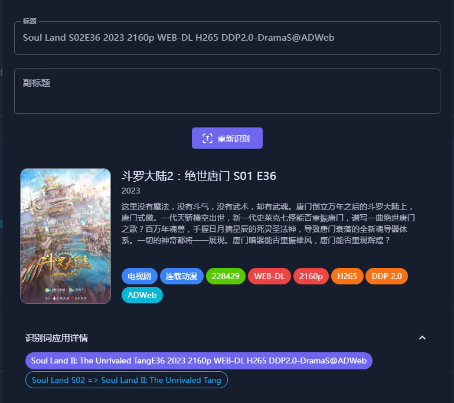
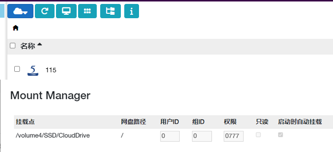
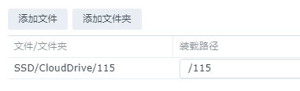

 - [一些说明](#一些说明)
 - [站点问题](#站点问题)
   - [为什么我的站点添加不了？](#为什么我的站点添加不了)
   - [日志提示站点认证失败 / 软件界面没有站点管理](#日志提示站点认证失败--软件界面没有站点管理)
   - [为什么我的站点添加了搜索不到内容？](#为什么我的站点添加了搜索不到内容)
   - [为什么CookieCloud一直同步失败？](#为什么cookiecloud一直同步失败)
 - [转移问题](#转移问题)
   - [转移媒体文件时提示“-1”错误 / 使用硬链接但是实际是复制](#转移媒体文件时提示-1错误--使用硬链接但是实际是复制)
   - [动漫内容如何配置二级分类文件来实现二级分类?](#动漫内容如何配置二级分类文件来实现二级分类)
 - [刮削问题](#刮削问题)
   - [刮削完成后演员不显示头像/英文名字](#刮削完成后演员不显示头像英文名字)
   - [刮削很慢或者是刮削不出图片 & 站点连接不上](#刮削很慢或者是刮削不出图片--站点连接不上)
   - [资源不识别导致无法刮削](#资源不识别导致无法刮削)
   - [文件名为"01.mp4"如何进行转移？](#文件名为01mp4如何进行转移)
 - [订阅问题](#订阅问题)
   - [日志里一直在搜索匹配没有订阅的电影/电视剧](#日志里一直在搜索匹配没有订阅的电影电视剧)
   - [日志提示添加任务失败](#日志提示添加任务失败)
   - [站点种子命名与tmdb不同导致搜索不到](#站点种子命名与tmdb不同导致搜索不到)
 - [功能补充](#功能补充)
   - [自定义制作组/字幕组](#自定义制作组字幕组)
   - [自定义占位符](#自定义占位符)
   - [自定义重命名](#自定义重命名)
   - [文件整理屏蔽词](#文件整理屏蔽词)
 - [微信通知问题](#微信通知问题)
   - [如何配置企业微信通知](#如何配置企业微信通知)
   - [如何建立企业微信的代理服务器？](#建立企业微信的代理服务器)
   - [配置企业微信时提示“回调失败”](#配置企业微信时提示回调失败)
   - [企业微信部署后不显示菜单](#企业微信部署后不显示菜单)
 - [其他问题](#其他问题)
   - [插件市场连接出错](#插件市场出错)  
   - [日志的时间显示不对 / 任务的执行时间不对](#日志的时间显示不对--任务的执行时间不对)
   - [插件界面显示404](#插件界面显示404)
   - [MoviePilot可以配置多个下载器吗？](#moviepilot可以配置多个下载器吗)
   - [ocr部署后无故自动重启无法使用](#ocr部署后无故自动重启无法使用)
   - [IOS快捷指令快速跳转MoviePilot搜索](#ios快捷指令快速跳转moviepilot搜索)
   - [使用moviepilot的插件生成strm文件](#使用moviepilot的插件生成strm文件)


# **一些说明**
 - 本仓库仅作为对[Moviepilot](https://github.com/jxxghp/MoviePilot/blob/main/README.md)的一些使用上的内容补充，发现问题时，请先仔细阅读原项目的[Readme](https://github.com/jxxghp/MoviePilot/blob/main/README.md)
  
 - [Moviepilot](https://github.com/jxxghp/MoviePilot/blob/main/README.md)的`docker&docker-compose`配置模板及`Ocr服务`的搭建教程[DDS-Derek/MoviePilot](https://github.com/DDS-Derek/MoviePilot/tree/docs)

 - 由于[Moviepilot](https://github.com/jxxghp/MoviePilot/blob/main/README.md)是在[Nastool](https://github.com/NAStool/nas-tools)的基础上开发的，因此很多教程也是共通的，例如`微信、tg、部分插件`的配置教程就可以参考[Nastool](https://github.com/NAStool/nas-tools)的相关教程。

 - 除此之外部分内容也可以参考[nas-tools-wiki](https://github.com/NAStool/nas-tools-wiki)的说明进行配置。

 - 提问题前一定记着先去看看日志，一般日志会写出问题所在，在提问时记得附上日志截图

 - 待补充
   
<br>

# **站点问题**

- ### 为什么我的站点添加不了？
MoviePilot使用的是`域名白名单`机制，如果添加不了可以去`站点公告`或者论坛查看站点的其他可用域名(一般为站点最新的域名)，并尝试添加。

例如问的最多的馒头，可以尝试将域名改为`xp.xxxxxx.io`进行添加

公开站点`Mikan`和`动漫花园`的可用域名如下，如果测试无法联通请勾选`代理`,并配置代理信息
>https://mikanani.me

>https://www.dmhy.org

<br>

- ### 日志提示站点认证失败 / 软件界面没有站点管理

1.查看[环境变量](https://github.com/jxxghp/MoviePilot/blob/main/README.md#2-用户认证)是否配置好,例如`iyuu`需要同时配置`AUTH_SITE` 、`IYUU_SIGN`两个变量

2.检查站点连接性，一般可能是代理的配置问题，可以尝试调整代理软件的规则，或者给mp的容器配置`https_proxy`和`no_proxy`变量。

3.仅有readme列表内的站点可以认证，其他站点无法认证

4.iyuu有时候会存在连接问题，可以尝试同时添加多个认证的参数避免出现无法认证的问题。

5.uid不是站点的昵称，可在站点用户中心查看。passkey也不是账号的密码，需要在站点的控制面板中查看。

6.直接复制passkey可能会在末尾多一个空格，可以检查一下。

7.可以同时配置多个认证站点，当站点连接不上时可以顺位使用下一个站点认证，应使用“,”进行分隔，例如iyuu,audiences

8.无论是windows版本还是docker版本，认证变量都需要写在环境变量中。

<br>

- ### 为什么我的站点添加了搜索不到内容？
可通过**查看日志**按以下顺序排查
1. `站点`或`tmdb`是否能正常连接上
2. 检查是否返回了搜索结果
3. 搜索结果是否被`搜索优先级`过滤
4. 有时种子名与tmdb进行匹配时，由于命名问题可能会同时存在多个同名影视，导致匹配到其他影视剧，也会造成搜索失败，此时建议直接去站点手动下载在使用目录同步入库，或是使用ptpp进行检索下载。

<br>

- ### 为什么CookieCloud一直同步失败？
1. 如果使用的是公共的CookieCloud服务端，需要检查一下容器内部是否能够连接上服务端。
   
2. 如果是本地自建的CookieCloud，浏览器可以正常连接而MoviePilot无法连接，一般可能是因为代理将本地地址也一并代理了。可以将代理配置为规则代理，并将本地地址设定为直连，也可以在环境变量中添加`no_proxy=localhost,127.0.0.0/8,10.0.0.0/8,172.16.0.0/12,192.168.0.0/16`，再进行尝试。

<br>

# **转移问题**

- ### 转移媒体文件时提示“-1”错误 / 使用硬链接但是实际是复制
一般出现这种提示是出现了跨盘的问题，在建立docker容器时，路径的映射容易出现以下情况
```yaml
        volumes:
            - '/volume1/video/media:/media' #注意右侧为容器内路径
            - '/volume1/video/link:/link'
```
 <div align=center>  </div>

此时在容器内部，视频文件和硬链接目录为无隶属关系的两个文件夹，此时使用硬链接时便会可能**报错或是硬链接变为复制**。正确的路径映射应为下面这种，映射一个大的目录进容器，将下载目录和硬链接的目录都设置在这个目录下面即可。
```yaml
        volumes:
            - '/volume1/video:/volume1/video' #此时容器内路径与容器外路径保持一致，并且只映射一个大目录
        environment:
            # 下载保存目录
            - 'DOWNLOAD_PATH=/volume1/video/download'
            - 'DOWNLOAD_MOVIE_PATH=/volume1/video/download/movies'
            - 'DOWNLOAD_TV_PATH=/volume1/video/download/tv'
            - 'DOWNLOAD_ANIME_PATH=/volume1/video/download/anime'
            # 媒体库目录
            - 'LIBRARY_PATH=/volume1/video/link'
            - 'LIBRARY_MOVIE_NAME=movies'
            - 'LIBRARY_TV_NAME=tv'
            - 'LIBRARY_ANIME_NAME=anime'

```
保持目录与宿主机一致，此时在配置文件中可以在后续维护中减少出问题的概率。关于其他容器关于路径的配置问题可以参见下面这张图
 <div align=center>  </div>

<br>

**补充①**:有些文件系统无法使用符号链接，此时硬链接与软链接均会报错，例如:`exFAT`,`FAT32`

除此之外，在`NTFS`文件系统上也可能会出现无法创建链接的问题。

**补充②**:使用网盘挂载时，请选择`rclone`或`软链接`的方式进行整理，或是将网盘挂载为本地目录并映射进docker容器内，使用`复制`或`移动`来进行整理。

<br>

- ### 动漫内容如何配置二级分类文件来实现二级分类？

MoviePilot本身是有提供动漫的二级分类的，但在二级分类的`category.yaml`配置文件中却与Nastool有所区别，动漫的相关配置不再具有`anime`的大分类，而需要写在`tv`也就是电视剧下面。

在实际转移的过程中MoviePilot会将具有`genre_ids: '16'`标识的分类作为动漫分类。下面是一个带有`动漫`的示例二级分类文件：

```yaml
movie:
  # 分类名同时也是目录名，会按先后顺序匹配，匹配后程序会按这个名称建立二级目录
  动画电影:
    # 分类依据，可以是：original_language 语种、production_countries 国家或地区、genre_ids 内容类型等，只要TMDB API返回的字段中有就行
    # 配置多项条件时，需要同时满足；不需要的匹配项可以删掉或者配置为空
    # 匹配 genre_ids 内容类型，16是动漫
    genre_ids: '16'
  华语电影:
    # 匹配语种
    original_language: 'zh,cn,bo,za'
  # 未配置任何过滤条件时，则按先后顺序不符合上面分类的都会在这个分类下，建议配置在最末尾
  外语电影:

# 配置电视剧的分类策略， 配置为空或者不配置该项则不启用电视剧分类
tv:
  # 分类名同时也是目录名，会按先后顺序匹配，匹配后程序会按这个名称建立二级目录
  完结动漫:
    # 匹配 genre_ids 内容类型，16是动漫
    genre_ids: '16'
    status: 'Ended,Canceled'
  连载动漫:
    # 匹配 genre_ids 内容类型，16是动漫
    genre_ids: '16'
  纪录片:
     # 匹配 genre_ids 内容类型，99是纪录片
    genre_ids: '99'
  儿童:
    # 匹配 genre_ids 内容类型，10762是儿童
    genre_ids: '10762'
  综艺:
    # 匹配 genre_ids 内容类型，10764 10767都是综艺
    genre_ids: '10764,10767'
  国产剧:
    # 匹配 origin_country 国家，CN是中国大陆，TW是中国台湾，HK是中国香港
    origin_country: 'CN,TW,HK'
  欧美剧:
    # 匹配 origin_country 国家，主要欧美国家列表
    origin_country: 'US,FR,GB,DE,ES,IT,NL,PT,RU,UK'
  日韩剧:
    # 匹配 origin_country 国家，主要亚洲国家列表
    origin_country: 'JP,KP,KR,TH,IN,SG'
  # 未匹配以上分类，则命名为未分类
  未分类:
```

使用这个文件生成的二级分类效果如下

```yaml
├─动漫
│  ├─完结动漫
│  └─连载动漫
├─电影
│  ├─动画电影
│  ├─华语电影
│  └─外语电影
└─电视剧
    ├─国产剧
    ├─日韩剧
    └─欧美剧
```

<br>

# **刮削问题**

- ### 刮削完成后演员不显示头像/英文名字

1.使用`演职人员刮削`插件,填写`扫描周期`后即可。

2.使用[MediaServerTools](https://github.com/sleikang/MediaServerTools)来刷新emby的元数据，config文件可在[这里](https://github.com/sleikang/MediaServerTools/blob/main/config/config.yaml)下载。

```yaml
version: '3.3'
services:
    MediaServerTools:
        container_name: MediaServerTools
        volumes:
            - './config:/config'
        environment:
            - TZ=Asia/Shanghai
            - PUID=1000
            - PGID=1000
            - UMASK=022
            - MediaServerTools_AUTO_UPDATE=true # 自动更新
            - MediaServerTools_CN_UPDATE=true # 使用国内源更新
        network_mode: host
        logging:
          driver: json-file
          options:
            max-size: 5m
        image: 'ddsderek/mediaservertools:latest'

```

<br>

- ### 刮削很慢或者是刮削不出图片 & 站点连接不上

1.检查日志

2.检查Tmdb、FanArt等网站的的连接性，推荐将这些站点手动添加到代理的规则列表或配置文件中。以下以clash为例：
```yaml
  - DOMAIN-SUFFIX,fanart.tv,🚀 节点选择 #🚀 节点选择更改为clash文件中的代理服务器组的名称即可
  - DOMAIN-KEYWORD,tmdb,🚀 节点选择
  - DOMAIN-KEYWORD,themoviedb,🚀 节点选择  
```

3.如果增加代理规则后还是没有改善，那么可以在MoviePilot的环境变量中新增下面两条：
```yaml
all_proxy=http://192.168.1.1:7890 #代理地址
no_proxy=localhost,127.0.0.0/8,10.0.0.0/8,172.16.0.0/12,192.168.0.0/16
```

**★需要注意的是，环境变量中添加`all_proxy`变量后，一定要添加`no_proxy`，否则可能会出现容器无法启动、无法连接emby、无法连接cookiescloud等问题**

<br>

- ### 资源不识别导致无法刮削

1.检查日志，查看是否能正常连接tmdb

2.资源名称命名与tmdb不同导致无法识别，下面是一个例子

 <div align=center>  </div>

 通过检查tmdb的剧集的别名可以看到，该剧集目前是没有`Otona_Precure_23`的译名的，因此也会导致MoviePilot无法识别

 <div align=center>  </div>

解决方法也很简单，在`设定-词表-自定义识别词`中填写

> **Otona_Precure_23 => Kibou no Chikara: Otona Precure `23**
> 
> 推荐优先将替换为**英文译名或原名**，中文译名有时候会歧义导致被经常修改

之后就可以正常识别了，有时候改完以后还无法识别，可以先**清除缓存**后再进行尝试。

 <div align=center>  </div>


<br>

- ### 文件名为"01.mp4"如何进行转移？
该文件命名MoviePilot无法识别，需要进行手动转移，转移的配置如下。其中`TMDBID`为手动在[TMDB站点](https://www.themoviedb.org)检索剧集后，查看剧集信息页面的网址，最后的数字即为该影视的`TMDBID`
 <div align=center>  </div>


<br>

# **订阅问题**

- ### 日志里一直在搜索匹配没有订阅的电影/电视剧

MoviePilot会定期使用站点的rss来匹配是否有订阅内容，此时会在日志中产生这些记录，对实际使用没有影响。

<br>

- ### 日志提示添加任务失败

1.检查下载器的配置信息，MoviePilot是否能正常连接下载器

2.检查下载器日志，是否因为多次密码错误而将MoviePilot的ip地址拉入黑名单

3.检查下载器内是否已经有相同的下载任务


<br>


- ### spider / rss订阅模式的区别

**spider模式**:添加订阅时，向所有订阅站点请求一次搜索，并对搜索结果进行匹配，对媒体库中不存在的剧集进行下载操作。之后每隔一段时间重复上述操作。

**rss模式**:首次添加订阅时，会进行与spider模式相同的操作，但之后更新内容的方式变为使用站点的RSS来获取新剧集的信息，因此使用该模式时需要配置好站点的RSS链接的内容，例如只勾选电视剧/动画，或者只指定需要订阅的官组，这样可以使RSS的内容更加干净，减少无关内容造成的订阅错误。

<br>

- ### 站点种子命名与tmdb不同导致搜索不到？

moviepilot在检索时会获取一部分`tmdb`的别名来同时检索，但有时候也会出现无法检索到内容的情况，下面是一个例子。

需要检索的内容为[斗罗大陆2：绝世唐门](https://www.themoviedb.org/tv/228429),但通过检索发现无法搜索到内容。
 <div align=center>  </div>

<br>

通过访问日志的链接可以发现，站点的种子命名与tmdb的并不一致，导致检索不到种子。
 <div align=center>  </div>

<br>

这种情况下可以添加一个订阅，并手动设置搜索关键词，将其保持与站点的种子命名一致，这样就可以正常检索到内容。
 <div align=center>  </div>
 <div align=center>  </div>

<br>

 值得注意的一点是，如果本身站点的命名就与tmdb不一致，那么即便能搜索到结果也可能会错误匹配其他内容，可能会需要添加一个自定义识别词来规范资源的命名，本例如果不添加下面两条自定义识别词，便会错误识别成`斗罗大陆的第二季`而非`斗罗大陆2：绝世唐门`。

 >Soul Land S02 => Soul Land II: The Unrivaled Tang
  
 >斗罗大陆.Soul.Land.S02 => Soul Land II: The Unrivaled Tang

  <div align=center>  </div>

<br>


# **功能补充**

- ### 自定义制作组/字幕组

> 补充制作组/字幕组的识别规则，填写位置为`设置-词表-自定义制作组/字幕组`
>

```
(?<=264\-)\w+(?=\.mkv);(?<=265\-)\w+(?=\.mkv)
(?<=264\-)\w+(?=\.mp4);(?<=265\-)\w+(?=\.mp4)
ADWeb
```

- ### 自定义占位符

> 补充制作组/字幕组的识别规则，填写位置为`设置-词表-自定义占位符`
>

```
(?<=1080p\.).*(?=\.WEB-DL);(?<=2160p\.).*(?=\.WEB-DL)
(?<=1080p\.).*(?=\.WEBRip);(?<=2160p\.).*(?=\.WEBRip)
\b(Baha|CR|B-Global|ABEMA|MyVideo|AMZN|KKTV|friDay|DSNP|LINETV|Crunchyroll|IQ|Hulu|HQ|60fps|Paramount+|LineTV|Linetv|Disney+|FriDay|HMAX|MAX|NF|IQY|IQ|TX|WeTV|YT|YK|Migu|Mgtv|Bilibili|Sohu|Xigua|iTunes)\b
```


- ### 自定义重命名

>填写位置为docker容器的环境变量里的`MOVIE_RENAME_FORMAT`和`TV_RENAME_FORMAT`

**剧集：**

```
{{title}} ({{year}})/Season {{season}}/{{title}} - {{season_episode}}-{{part}} - {{videoFormat}} - {{videoCodec}} - {{audioCodec}} - {{customization}} - {{releaseGroup}}{{fileExt}}
```

**电影：**

```
{{title}} ({{year}})/{{title}} ({{year}})-{{part}} - {{videoFormat}} - {{videoCodec}} - {{audioCodec}} - {{releaseGroup}}{{fileExt}}
```

- ### 文件整理屏蔽词
> 自动整理时排除无用的其他文件，填写位置为`设置-词表-文件整理屏蔽词`
>

```
Special Ending Movie
\[((TV|BD|\bBlu-ray\b)?\s*CM\s*\d{2,3})\]
\[Teaser.*?\]
\[PV.*?\]
\[NC[OPED]+.*?\]
\[S\d+\s+Recap(\s+\d+)?\]
Menu
Preview
\b(CDs|SPs|Scans|Bonus|映像特典|特典CD|specials|Menu|Preview|/mv)\b
\b(NC)?(Disc|SP|片头|OP|片尾|ED|PV|CM|MENU|EDPV|SongSpot|BDSpot)(\d{0,2}|_ALL)\b
```

<br>

# **微信通知问题**

- ### 如何配置企业微信通知
  
  1.参见[此教程](https://pt-helper.notion.site/50a7b44e255d40109bd7ad474abfeba5)
  2.目前有热心网友提供了`免费`的[代理服务器地址](https://github.com/PTLSP/MoviePilot-Wechat-PROXY)，如果自己没有vps可以先使用免费的代理服务器，尝试一下效果。
  <br>

- ### 建立企业微信的代理服务器
  

首先需要先准备一个具有固定公网地址的服务器，例如VPS，之后在该服务器上搭建代理服务。搭建方式可以有以下两种，两种任选其一即可

 > #### 1、使用[`caddy`](https://github.com/caddyserver/caddy)搭建

  1. 从 https://github.com/caddyserver/caddy/releases
下载自己对应系统的版本，例如 AMD64 下载`caddy_2.7.5_linux_amd64.tar.gz`
  1. 解压得到 `caddy` 文件 上传到`/usr/local/bin` 目录下，注意设置权限 `0755`
  2. 在任意目录新建 `Caddyfile` 文件(例如`/usr/local/caddy`) ，注意设置权限 `0755`，文
件内容如下
```yaml
:3000
reverse_proxy https://qyapi.weixin.qq.com {
header_up Host {upstream_hostport}
}
```
  1. SSH 控制台 cd 到 `Caddyfile` 文件的目录(例如`/usr/local/caddy`)
  2. 输入 caddr start 启动完成，在防火墙中放行3000端口
  3.  NasTools / MoviePilot 设置微信的代理 IP 地址为 `http://你的服务器ip/域名:3000`

<br>

 > #### 2、使用[ddsderek/wxchat](https://hub.docker.com/r/ddsderek/wxchat)docker镜像搭建

```yaml
version: '3.3'
services:
    wxchat:
        container_name: wxchat
        restart: always
        ports:
            - '3000:80'
        image: 'ddsderek/wxchat:latest'
```
```
docker run -d \
    --name wxchat \
    --restart=always \
    -p 3000:80 \
    ddsderek/wxchat:latest
```
搭建完成后，在防火墙中放行3000端口，并在NasTools / MoviePilot 设置微信的代理 IP 地址为 `http://你的服务器ip/域名:3000`

<br>

- ### 配置企业微信时提示“回调失败”
  

 1.在企业微信的填写的地址可以有两种方式

 ①`http://ip:端口/api/v1/message/?token=moviepilot`

 ②`http://ip:端口/api/v1/message/`

 如果自行配置了`API_TOKEN`的值，那么就需要在地址后面补上`?token=moviepilot`。如果`API_TOKEN`为默认值，那么两种填写方式均可。

 2.确认在手机打开流量时，直接打开`http://ip:端口`，可以直接访问MoviePilot的网页。

 3.微信不支持ipv6,因此如果域名是使用ipv6解析的时候，也会导致不通过。如果没有ipv4的公网ip，建议使用内网穿透。

 <br>

 - ### 企业微信部署后不显示菜单

如果是沿用nastool的代理服务器配置，需要在`nginx`的配置文件中额外加入下列代码，才能自动生成菜单。

```
location  /cgi-bin/menu/create {
    proxy_pass https://qyapi.weixin.qq.com;
}
```

如果还是没有正常生成菜单，也可以手动添加菜单，具体的命令列表如下。

> /cookiecloud 同步站点
> 
> /sites 查询站点
> 
> /site_cookie 更新站点Cookie
> 
> /site_enable 启用站点
> 
> /site_disable 禁用站点
> 
> /mediaserver_sync 同步媒体服务器
> 
> /subscribes 查询订阅
> 
> /subscribe_refresh 刷新订阅
> 
> /subscribe_search 搜索订阅
> 
> /subscribe_delete 删除订阅
> 
> /subscribe_tmdb 订阅元数据更新
> 
> /downloading 正在下载
> 
> /transfer 下载文件整理
> 
> /redo 手动整理
> 
> /clear_cache 清理缓存
> 
> /restart 重启系统
> 
> /site_signin 站点签到
> 
> /site_statistic 站点数据统计

 <br>

### 

<br>

# **其他问题**

- ### 插件市场出错
1、检查复制时有无错漏，每个插件地址是否都能正常打开，以下是目前常用的插件市场地址，可直接复制至`PLUGIN_MARKET`变量中

```
https://raw.githubusercontent.com/jxxghp/MoviePilot-Plugins/main/,https://raw.githubusercontent.com/thsrite/MoviePilot-Plugins/main/,https://raw.githubusercontent.com/honue/MoviePilot-Plugins/main/,https://raw.githubusercontent.com/dandkong/MoviePilot-Plugins/main/,https://raw.githubusercontent.com/Aqr-K/MoviePilot-Plugins/main/,https://raw.githubusercontent.com/AnjoyLi/MoviePilot-Plugins/main/,https://raw.githubusercontent.com/WithdewHua/MoviePilot-Plugins/main/,https://raw.githubusercontent.com/HankunYu/MoviePilot-Plugins/main/,https://github.com/almus2zhang/MoviePilot-Plugins,https://github.com/baozaodetudou/MoviePilot-Plugins,https://github.com/HankunYu/MoviePilot-Plugins
```

2、配置代理信息,例如可以在环境变量中加入下面两个环境变量

>https_proxy=http://127.0.0.1:7890
>
>no_proxy=localhost,127.0.0.0/8,10.0.0.0/8,172.16.0.0/12,192.168.0.0/16

<br>

- ### 日志的时间显示不对 / 任务的执行时间不对

添加**环境变量**`TZ=Asia/Shanghai`

<br>

- ### 插件界面显示404

在网页右下角有一个“+”号，点击即可添加插件

<br>


 - ### MoviePilot可以配置多个下载器吗？
目前只支持配置**一个**`Qbittorrent`和**一个**`Transmission`

<br>

 - ### Ocr部署后无故自动重启/无法使用

Ocr与主机的CPU有关，无法使用通常是CPU不支持导致的，例如常用的J4125就无法部署。

<br>

 - ### IOS快捷指令快速跳转MoviePilot搜索

  参见此项目[Shortcuts-Moviepilot](https://github.com/honue/Shortcuts-Moviepilot)

<br>

 - ### 使用Moviepilot的插件生成strm文件

1、在环境变量`PLUGIN_MARKET`中添加插件市场的地址`https://raw.githubusercontent.com/thsrite/MoviePilot-Plugins/main/`

2、在Moviepilot中安装`云盘Strm生成`插件

3、将`CloudDrive2 / Alist`的网盘挂载地址**原样**映射进Moviepilot的容器，例如
 <div align=center>  </div>

 在这个例子中我将`CloudDrive2`的根路径挂载到了本地的`/volume4/SSD/CloudDrive`路径下面，此时`115`网盘在本地的实际挂载路径为`/volume4/SSD/CloudDrive/115`。
 
 此时我们需要给Moviepilot的容器增加一条路径的映射，其中容器内的`/115`应该和`CloudDrive2`内部的115网盘的路径相同。

 <div align=center>  </div>

 4、插件配置

 虽然插件能够生成本地路径的strm文件，但个人还是更推荐生成`API`类型的strm文件，兼容性和可操作性都会更好一些，也就是下面这个方式。
 > 监控方式#监控目录#目的目录#cd2#cd2挂载本地跟路径#cd2服务地址

 按照上面的配置方式，下面是一个例子
 
 > compatibility#/115/动漫#/volume5/网盘/动漫#cd2#/volume5/网盘/动漫#192.168.31.136:19798

其中第一条`/115/动漫`为需要生成的网盘文件夹的路径，也就是需要监控的路径，第二和第三条可以填写`strm文件`的生成目的路径（这个路径是容器内的路径），并且二者可以保持相同，最后的ip地址为`CloudDrive2`的服务端地址。

<br>

5、常见问题

 - 日志显示找不到监控目录
  
一般常见于重启设备，cd2的自动挂载失败或晚于docker容器的自动启动，此时只需要重新进入cd2内挂载路径，并重启mp的容器即可。

<br>

 - 生成strm文件时，网盘的登录信息失效了

常见于`115`网盘，一次性生成太多可能会导致这个情况。可以将需要生成的路径分割，依次生成。

<br>

 - 这个插件会重复生成`strm文件`吗？

并不会，已经生成过的文件，在下次触发时会直接跳过，所以可以在批次生成完后，直接监控整个大目录。

<br>

 - 为什么这个插件要做麻烦的路径映射，而不是其他类似脚本使用`webdav`

因为这个插件的优势之一就是可以`监控新内容的产生`，并同步生成`strm文件`，而使用`webdav`类型的脚本做不到这一点。